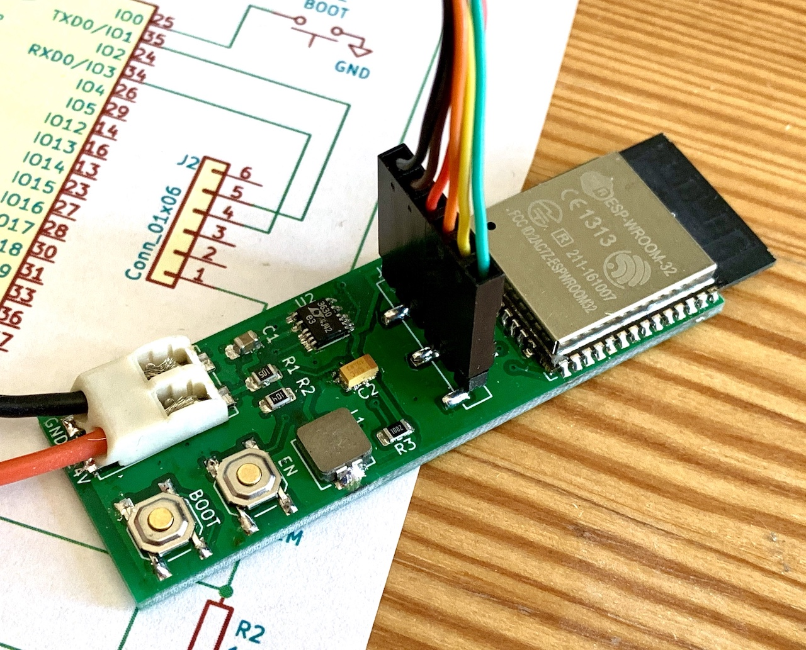

# ESP32 WiFi voltage meter

This is a simple voltage meter that can be powered from about 5 to 24v
and queried via WiFi.

## PCB

## Software

## Usage

### WiFi Configuration

### ADC Voltage Calibration

Drop into ADC calibration menu at boot:

    [...]
    Press any key within the next 2 seconds to enter configuration mode
    Press any key within the next 1 seconds to enter configuration mode
    Key press detected
    Entering configuration mode

    Choose a setting to change:
    w - WiFi settings
    i - IP address settings
    c - ADC voltage measurement calibration
    r - Reboot
    > c

    Raw ADC value: 0.217, calibrated value: 9.438, y-intercept: 1.358, slope: 37.318
    Choose an option:
    i - change calibration y-intercept
    s - change calibration slope
    n - Commit current values to non-volatile storage
    c - cancel

Determine calibration y-intercept and slope values:

* Set input voltage to 5v, hit the return key a few times, note the ADC raw value, e.g. 0.097
* Set input voltage to 24v, hit the return key a few times, note the raw value, e.g. 0.607
* Slope = delta_voltage/delta_adc = (24-5)/(0.607-0.097) = 37.2549
* Y-intercept = voltage - (adc * slope() = 24-(0.607*37.2549) = 1.3863

Set those values using the menu options and hit return a few times to check.
Change the voltage and check again.

Commit the values to non-volatile storage with the corresponding menu command.